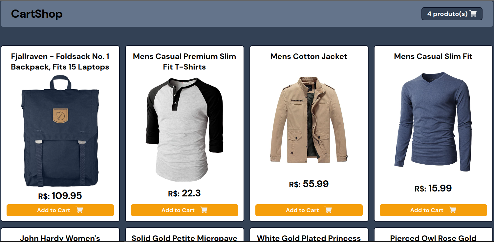

# React + TypeScript + Vite



# ShopCart - Carrinho de Compras

O projeto ShopCart é uma aplicação web que demonstra um carrinho de compras simples. A aplicação é construída utilizando React.js, TypeScript, Tailwind CSS e gerenciamento de estado com Zustand.

## Funcionalidades

- **Renderização da API:** A aplicação renderiza dados de uma API simulada para exibir produtos disponíveis.
- **Carrinho de Compras:** Os usuários podem adicionar itens ao carrinho de compras.
- **Soma do Valor Total:** A aplicação calcula dinamicamente o valor total dos itens no carrinho.
- **Gestão de Estado com Zustand:** O estado da aplicação é gerenciado de forma eficiente utilizando Zustand, facilitando a atualização e compartilhamento de dados entre componentes.
- **Checkout e Pagamento:** O projeto oferece funcionalidades básicas de checkout e pagamento.
- **Feedback de pagamento:** Após o submissão do pagamento, é exibida uma mensagem de confirmação para o usuário, informando número do pedido a forma de pagamento utilizada, tempo de espera determinado pela forma de pagamento.

## Tecnologias Utilizadas

- **React.js**: Biblioteca React utilizado para a construção da aplicação.
- **TypeScript**: Adiciona tipagem estática ao JavaScript, aumentando a robustez e a manutenibilidade do código.
- **Tailwind CSS**: Framework de CSS utilizado para estilização dos componentes, proporcionando uma experiência de desenvolvimento mais rápida e consistente.
- **Zustand**: Biblioteca de gerenciamento de estado para React, tornando o compartilhamento de estado entre componentes simples e eficiente.
- **LocalStorage** - API para armazenamento local de dados.
- **Formik**: adiciona tipagem estática ao JavaScript, aumentando a robustez e a manutenibilidade do código.
- **Yup**: uma biblioteca que permite validar os dados dos formulários.
- **react-input-mask**: Adiciona máscaras personalizados aos campo de input.

## Como Executar

1. Clone o repositório do projeto:

```bash
git clone https://github.com/seu-usuario/shopcart.git
cd shopcart
Instale as dependências:
bash
Copy code
npm install
# ou
yarn install
Inicie o servidor de desenvolvimento:
bash
Copy code
npm run dev
# ou
yarn dev
Acesse a aplicação em seu navegador através do endereço http://localhost:3000.
Contribuição
Contribuições são bem-vindas! Sinta-se à vontade para enviar pull requests ou abrir issues para reportar bugs ou sugerir novas funcionalidades.

Licença
Este projeto está licenciado sob a MIT License.

